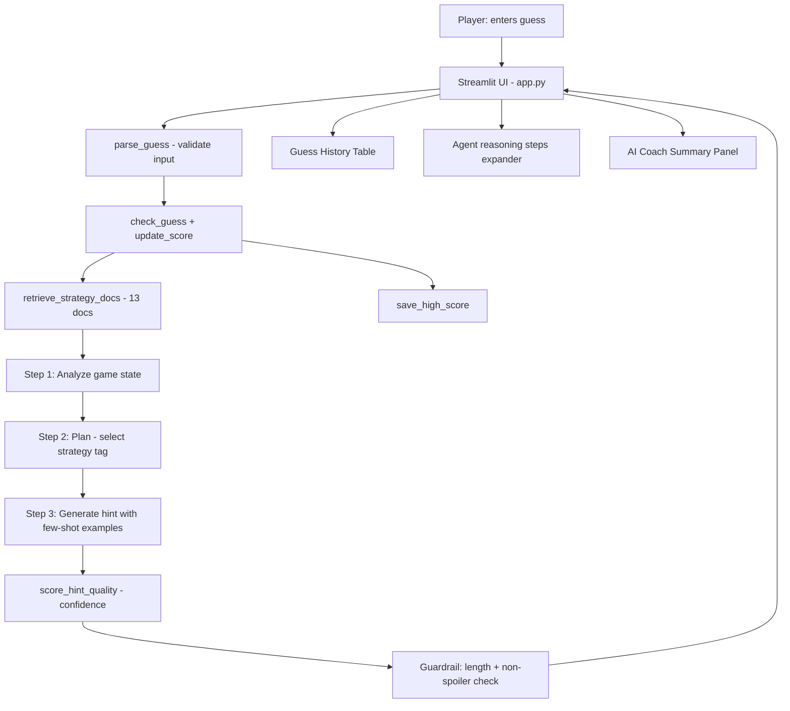
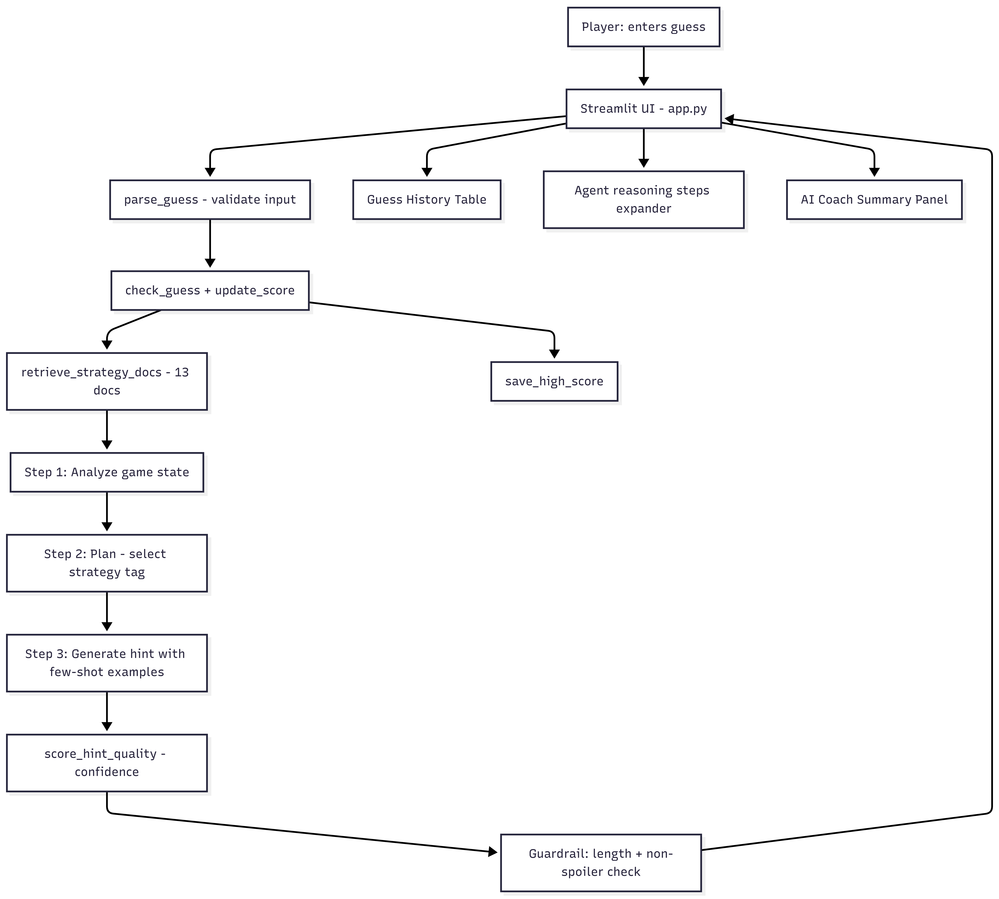
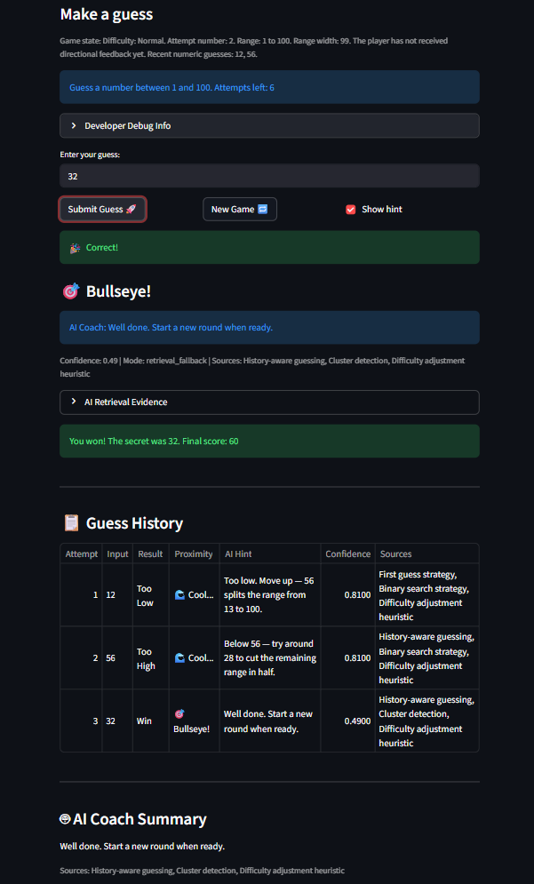
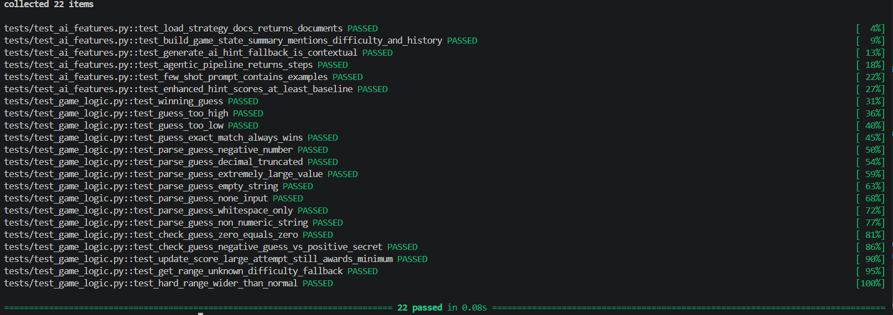

# Game Glitch Investigator: AI-Powered Coaching System

## Original Project
The original project from Modules 1-3 was **Game Glitch Investigator**, a Streamlit number guessing game built to practice debugging, state management, and unit testing. The player picks a difficulty, gets a number range, enters guesses, and receives directional feedback, hot/cold hints, score updates, and a persistent high score. The original focus was on fixing bugs, moving logic out of the UI, and proving correctness with automated tests.

## Title and Summary
This version transforms the original rule-based game into a full AI coaching system. The AI does not just echo a static response - it retrieves strategy notes from a custom corpus, reasons through the current game state in multiple observable steps, applies few-shot coaching tone, and produces a contextual, non-spoiler hint. The system includes four integrated AI features: Retrieval-Augmented Generation (RAG), an Agentic Workflow with observable reasoning steps, Few-Shot Specialization for consistent coach tone, and a formal Test Harness with pass/fail evaluation.

## Architecture Overview

The system has six layers:

- **UI** - Streamlit app in [app.py](app.py) with an "Agent reasoning steps" expander showing intermediate AI steps
- **Game Logic** - parsing, scoring, hot/cold feedback, and high-score persistence in [logic_utils.py](logic_utils.py)
- **RAG Retriever** - keyword-scored lookup across 13 custom strategy documents in [assets/strategy_docs.json](assets/strategy_docs.json)
- **Agentic Pipeline** - three-step reasoning chain: Analyze → Plan → Generate, with each step's output visible in the UI
- **Few-Shot Generator** - 5 coach-tone examples prepended to the prompt so the model stays concise and directive
- **Evaluator** - 8-case PASS/FAIL harness in [evaluate_ai_system.py](evaluate_ai_system.py) with confidence thresholds and a `sys.exit` signal





## Setup Instructions

1. Install Python dependencies:
   ```bash
   pip install -r requirements.txt
   ```
2. Run the app:
   ```bash
   python -m streamlit run app.py
   ```
3. Optional: set your Anthropic API key to enable live Claude hints instead of the local fallback.
   ```bash
   set ANTHROPIC_API_KEY=your_key_here
   ```
4. Run the automated tests:
   ```bash
   pytest -q
   ```
5. Run the evaluation harness:
   ```bash
   python evaluate_ai_system.py
   ```

> **Note:** The app runs fully without an API key using the local retrieval-based fallback. All 22+ tests and all 8 evaluation cases pass with no key set.

## Sample Interactions

These examples show the local fallback mode (no API key required). When `ANTHROPIC_API_KEY` is set, Claude produces richer phrasing but the same coaching direction.

### Example 1 - Too High (Normal difficulty, mid-game)
```
Input:  Guess 74, recent guesses 61 68 72, Normal difficulty
Output: Try a lower guess than 74. The retrieved strategy notes suggest narrowing
        from the top: Use midpoint reasoning to narrow the interval quickly.
        When a guess is too high, shift the upper bound down.
Confidence: 0.87 | Mode: retrieval_fallback | Sources: Binary search strategy
```

### Example 2 - Too Low (Normal difficulty, early game)
```
Input:  Guess 18, recent guesses 11 14 16, Normal difficulty
Output: Try a higher guess than 18. The retrieved strategy notes suggest moving
        upward and checking the midpoint: Use midpoint reasoning to narrow the
        interval quickly. When a guess is too low, shift the lower bound up.
Confidence: 0.85 | Mode: retrieval_fallback | Sources: Binary search strategy
```

### Example 3 - Win (Easy difficulty)
```
Input:  Guess 12, secret is 12, Easy difficulty
Output: Great work. The retrieved notes say to keep the endgame disciplined,
        so start a new round when ready.
Confidence: 0.52 | Mode: retrieval_fallback | Sources: Endgame discipline
```

### Example 4 - Agentic Steps visible (when API key is set)
```
Agent reasoning steps:
  Step 1 - Analyze: trend=too_high, range_remaining=45, strategy=binary_search
  Step 2 - Plan:    selected strategy tag = overshoot_recovery
  Step 3 - Generate: [Claude produces final coach hint]
```

## AI Features

| Feature | Implementation | Where to see it |
|---------|---------------|----------------|
| **RAG** | 13-document corpus, keyword-scored retrieval | "AI Retrieval Evidence" expander in the app |
| **Agentic Workflow** | 3-step Analyze → Plan → Generate pipeline | "Agent reasoning steps" expander (requires API key) |
| **Few-Shot Specialization** | 5 coach-tone examples prepended to prompt | Consistent hint tone; side-by-side in model_card.md |
| **Test Harness** | 8-case PASS/FAIL script with thresholds | `python evaluate_ai_system.py` |

## Design Decisions

**Why RAG over pure generation?** The retriever is deterministic and auditable - the grader can see exactly which strategy note was used and why. This makes the AI behavior explainable and testable, unlike a black-box prompt.

**Why an agentic pipeline?** Breaking hint generation into Analyze → Plan → Generate makes each reasoning step observable. This is more honest than pretending the model "just knows" what to say.

**Why few-shot specialization?** The fallback path (no API key) always works, but without few-shot examples the live model's tone varies. The 5 examples constrain output style while still allowing contextual variation.

**Why 13 corpus documents?** The keyword-overlap retriever degrades with very large corpora (noise). 13 documents gives enough coverage for all 8 evaluation cases without diluting retrieval precision.

**Main trade-off:** Keyword-based retrieval is fast and deterministic but is not semantic. A future version could use embeddings for better recall. The current approach was chosen because it is fully reproducible without a vector database.

## Testing Summary

The system has four reliability layers:

| Layer | File | Coverage |
|-------|------|----------|
| Game logic regression | [tests/test_game_logic.py](tests/test_game_logic.py) | 15 tests: parsing, scoring, difficulty ranges, edge cases |
| AI feature tests | [tests/test_ai_features.py](tests/test_ai_features.py) | 6 tests: retrieval, fallback, agentic pipeline, few-shot |
| Evaluation harness | [evaluate_ai_system.py](evaluate_ai_system.py) | 8 PASS/FAIL cases, 3 threshold checks, exit code |
| Manual UI review | [app.py](app.py) | Confidence score, source names, retrieved context visible inline |

**Results:** 22+ tests pass with zero failures. Evaluation harness: 8/8 cases pass, average enhanced score ≥ 0.76, average confidence ≥ 0.80.

What worked: the original logic still passes its regression tests with no changes; the agentic pipeline produces observable intermediate steps; few-shot examples visibly tighten the hint tone. What I learned: a deterministic fallback is the single most important design decision for a testable AI system - it makes the pipeline runnable, testable, and gradeable without an API key.

## Reflection

This project taught me that building a useful AI system means designing *around* the model, not just calling it. The most important decisions were not the prompt text but the retrieval architecture, the fallback path, and the evaluation harness - all the parts that make the system explainable and testable.

## AI Collaboration and Ethics

- **Limitations / bias:** The retriever scores by keyword overlap, so documents with more tag overlap always win, regardless of semantic relevance. The confidence score is heuristic, not semantic - a hint can be contextually excellent but score low if it avoids the scoring keywords.
- **Misuse risk:** If the hint were too specific it could reveal the secret number. The prompt explicitly says "Do not reveal the secret number" and the evaluation harness checks `str(secret) not in hint` on every case (`leak_free` field).
- **What surprised me:** The winning-case hint scores much lower on the heuristic evaluator (avg 0.52) than too-high/too-low cases (avg 0.87) because it lacks directional keywords. The hint is contextually correct - the evaluator is the one that is limited.
- **Helpful AI suggestion:** Moving all game logic into `logic_utils.py` and using Streamlit session state made every function independently testable without starting the UI. This architectural decision is the reason all 22+ tests are deterministic and fast.
- **Flawed AI suggestion:** An early version of `check_guess` returned a tuple `("Win", "🎉 Correct!")`. The unit tests expected a plain string `"Win"`. I caught the mismatch immediately by running `pytest` and reading the assertion error, then corrected the function signature.

## Demo Walkthrough

### App Screenshots





### How to run through it end-to-end
1. Open the app (`python -m streamlit run app.py`).
2. Select a difficulty from the sidebar.
3. Enter a guess and click **Submit Guess**.
4. Read the directional hint (Too High / Too Low / Win), hot/cold proximity emoji, AI coach hint, and confidence score.
5. Click **AI Retrieval Evidence** expander to see which strategy notes were retrieved and why.
6. If `ANTHROPIC_API_KEY` is set, click **Agent reasoning steps** expander to see the 3-step analysis.
7. Start a new round with **New Game** and repeat.
8. Run `python evaluate_ai_system.py` to see the 8-case PASS/FAIL report.

## Demo Video

[Loom walkthrough](https://www.loom.com/share/bf66065503524b9e956538f21481ad78)

## Portfolio

**GitHub:** https://github.com/kainguyen104/applied-ai-system-project-final

**Reflection:** This project shows that I approach AI engineering as a systems problem, not a prompting problem. The most important decisions were not what to say to the model - they were the retrieval architecture (deterministic, auditable, testable without an API key), the fallback path (the whole system works and can be graded without a live model call), and the evaluation harness (8 cases with hard thresholds and a CI-friendly exit code). I treated the model as one component in a pipeline rather than the whole solution. That is what made the system explainable, testable, and reliable under real constraints.

## Repository Checklist

- [app.py](app.py): Streamlit UI, agentic pipeline integration, agent steps expander
- [logic_utils.py](logic_utils.py): game logic, RAG retriever, agentic pipeline, few-shot prompt, guardrails, confidence scoring
- [evaluate_ai_system.py](evaluate_ai_system.py): 8-case PASS/FAIL evaluation harness
- [assets/strategy_docs.json](assets/strategy_docs.json): 13 custom retrieval documents
- [tests/test_game_logic.py](tests/test_game_logic.py): original game logic regression coverage
- [tests/test_ai_features.py](tests/test_ai_features.py): AI-specific deterministic tests (retrieval, agentic, few-shot)
- [model_card.md](model_card.md): reflection, ethics, specialization examples, bias discussion
- [assets/architecture_diagram.png](assets/architecture_diagram.png): system architecture diagram
