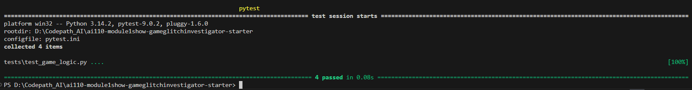
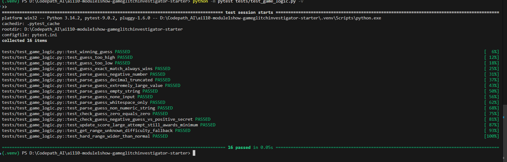
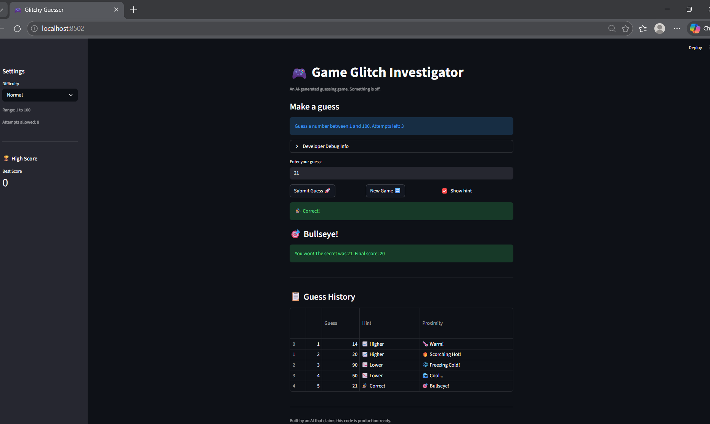

# 🎮 Game Glitch Investigator: The Impossible Guesser

## 🚨 The Situation

You asked an AI to build a simple "Number Guessing Game" using Streamlit.
It wrote the code, ran away, and now the game is unplayable. 

- You can't win.
- The hints lie to you.
- The secret number seems to have commitment issues.

## 🛠️ Setup

1. Install dependencies: `pip install -r requirements.txt`
2. Run the broken app: `python -m streamlit run app.py`

## 🕵️‍♂️ Your Mission

1. **Play the game.** Open the "Developer Debug Info" tab in the app to see the secret number. Try to win.
2. **Find the State Bug.** Why does the secret number change every time you click "Submit"? Ask ChatGPT: *"How do I keep a variable from resetting in Streamlit when I click a button?"*
3. **Fix the Logic.** The hints ("Higher/Lower") are wrong. Fix them.
4. **Refactor & Test.** - Move the logic into `logic_utils.py`.
   - Run `pytest` in your terminal.
   - Keep fixing until all tests pass!

## 📝 Document Your Experience

- [x] Describe the game's purpose: a number guessing game where the player picks a difficulty, gets a range, and tries to guess the secret number within a limited number of attempts.
- [x] Detail which bugs you found:
  - `check_guess` and other functions in `logic_utils.py` were stubs that only raised `NotImplementedError`
  - On every even-numbered attempt, the secret was cast to a string, causing wrong hints
  - Hard difficulty had a narrower range (1–50) than Normal (1–100), making it easier instead of harder
- [x] Explain what fixes you applied:
  - Moved all game logic from `app.py` into `logic_utils.py` and implemented the stub functions
  - Removed the even-attempt string cast so comparisons always use integers
  - Changed Hard difficulty range to 1–200 so it is actually harder than Normal

## 📸 Demo

- [ ] [Insert a screenshot of your fixed, winning game here]

## 🚀 Stretch Features

### Challenge 1: Advanced Edge-Case Testing

I added nine more tests to `tests/test_game_logic.py` to cover inputs that could break the game in unexpected ways. These included things like negative numbers, decimals, extremely large values, empty strings, None, and whitespace. I also tested boundary conditions like guessing zero, winning on the minimum score, and making sure Hard difficulty actually has a wider range than Normal.

### Challenge 2: High Score Tracker

I added two functions to `logic_utils.py` — one to load the saved high score from a file and one to save a new one if the player beats it. The sidebar now shows the best score using `st.metric`, and it updates automatically when you win. Claude helped plan and scaffold this feature in Agent Mode.

### Challenge 3: Professional Documentation and Linting

I went through every function in `logic_utils.py` and added proper docstrings that explain what each function does, what arguments it takes, and what it returns. I also reviewed the code for PEP 8 style issues like spacing and naming.

### Challenge 4: Enhanced Game UI

The hints are now color-coded — green when you win, red when you guess too high, and blue when you guess too low. After each guess, a hot/cold label also appears to show how close you are, ranging from Scorching Hot to Freezing Cold. At the bottom of the page there is a guess history table that tracks every guess you made along with the hint and proximity rating for each one.

